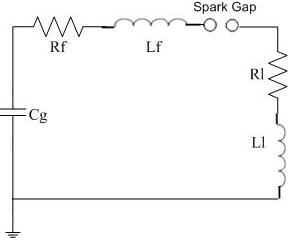
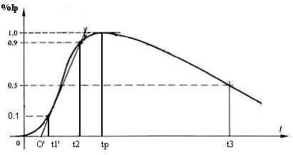

## Theory

Impulse current can have varying wave shapes and magnitudes depending upon their application and occurrence. Often, impulse currents appear as periodic or damped oscillatory currents.

Impulse current waveforms are represented as damped sinusoids given as

I (t) = Io [e-at sin (wt)]

where 'a' is damping constant and 'w' is the frequency of the sinusoid.

Fig:1

The characteristic parameters and the nature of the standard waveform are shown in figure 1. The standard parameters characterizing the waveform are front time ( tf ), tail time ( tt ) and peak value of current ( Ip ). The front time and the tail time are calculated as below:

Fig:12

1. Referring to the wave shape in figure, the peak value is fixed and referred to as 100% value. The points corresponding to 10% and 90% of the peak values are found on the front portion.
2. The line joining these points is extended to cut the time axis at O'. O' is taken as the virtual origin.
3. Now, 1.25 times the time interval between times corresponding to 10% and 90% of peak value of the waveform is defined as the front time (tf ).
4. Starting from the virtual origin, the time corresponding to the point on the wave tail for 50% of the peak value of the waveform is known as the tail time (tt).
-- Tolerance that can be allowed both on the front time and the tail time is + 10%. -- Tolerance allowed on peak value is +20% and -0%.

### Standard impulse current wave shapes

Front time tf (µs) | Tail time tt (µs) | Std. notation
:--| :--| :--|
1.0 ± 0.1 |	20.0 ± 2.0	|1/20
4.0 ± 0.4|	10.0 ± 1.0	|4/10
8.0 ± 0.8	|20.0 ± 2.0|	8/20
30.0 ± 3.0|	80.0 ± 8.0	|30/80